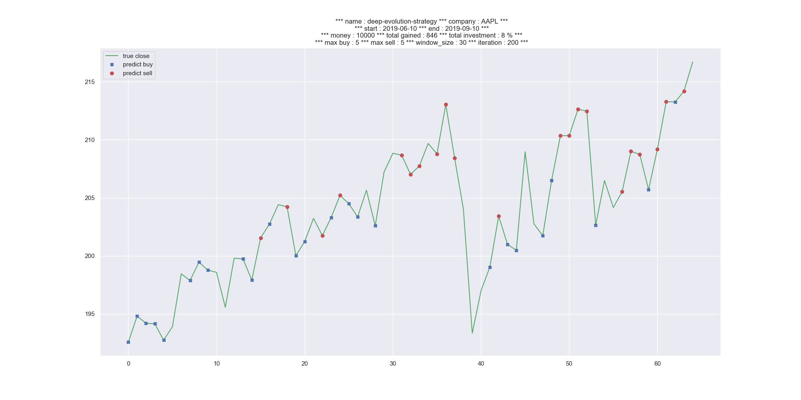

# Agent trading deep evolution strategy

## Dependencies
Proceed to install with 'pip install' with python3
- numpy
- matplotlib
- pandas
- pandas_datareader
- seaborn

## How to use it?
Edit the main.py script and enter the desired parameters like the stock you want to check out, the money you have etc.
Launch the script.
Done!

